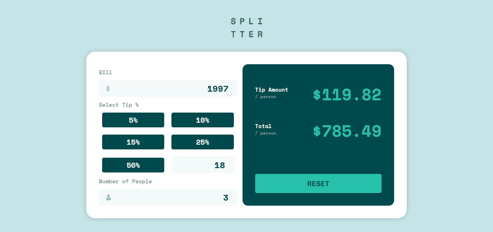
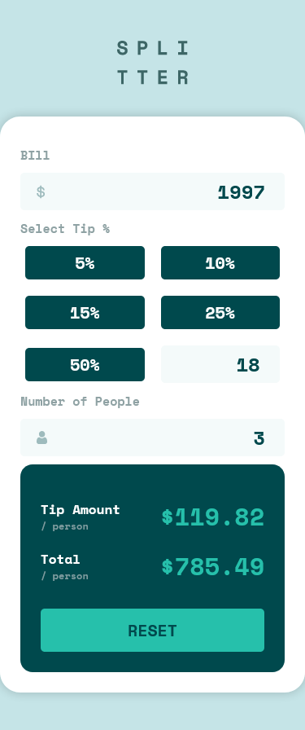

# Frontend Mentor - Tip calculator app solution

This is my solution to the [Tip calculator app challenge on Frontend Mentor](https://www.frontendmentor.io/challenges/tip-calculator-app-ugJNGbJUX).

## Table of contents

- [Overview](#overview)
  - [Screenshot](#screenshot)
  - [Links](#links)
  - [Built with](#built-with)

## Overview

### Screenshot

  

  

### Links

- Live Site URL: (https://hrcg.dev/splitter/)

### Built with

- HTML
- SCSS
- JavaScript
- Flexbox
- Mobile-first workflow
